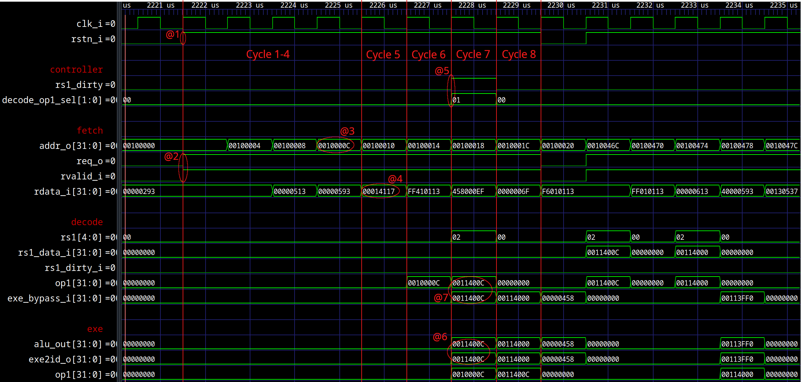
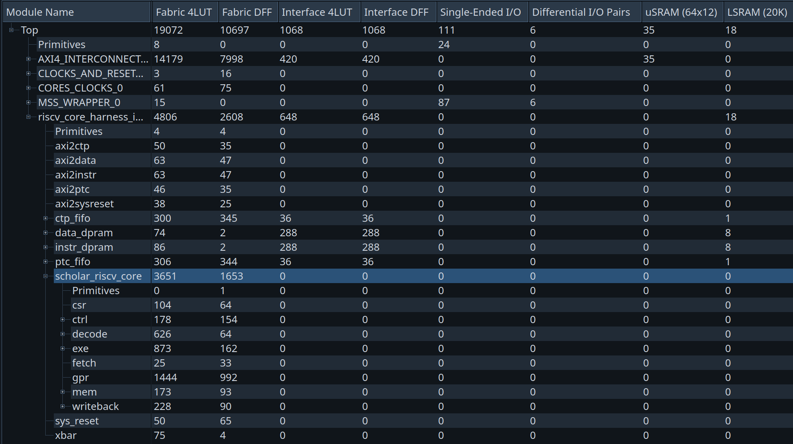

# scholar risc-v Processor – Pipeline Microarchitecture with Bypassing

This document introduces the **scholar risc-v** processor in its **pipelined** version with **bypassing**.<br>
Designed as an educational project, **scholar risc-v** illustrates the internal workings of a RISC-V processor while serving as a scalable learning platform for students in computer architecture and digital systems.

This document provides an overview of the **bypassing** mechanism, lists the supported instructions, explains how the processor operates at this stage of development, and discusses both its performance and limitations. Finally, it outlines the next planned steps for the project’s evolution.

The **pipelined** **scholar risc-v** with **bypassing** represents the second enhancement of the microarchitecture.<br>
If you have not read the previous version describing the baseline **pipelined** core, please refer to the [pipeline](https://github.com/Kawanami-git/scholar-risc-v/tree/pipeline) branch.

This version remains **single-issue** (only one instruction is issued per cycle).<br>
At this stage, the processor supports the **RV32I** and **RV64I** base instruction sets, along with mcycle (Zicntr) and several HPM-like performance counters (mhpmcounter3…mhpmcounter13) for CycleMark profiling: 
- `mhpmcounter3` (stall cycles). 
- `mhpmcounter4` (taken branches).
- `mhpmcounter5` (Exe -> Decode bypass (op1 or op2)).
- `mhpmcounter6` (Exe -> Decode bypass (op3)).
- `mhpmcounter7` (Mem -> Decode bypass (op1 or op2)).
- `mhpmcounter8` (Mem -> Decode bypass (op3)).
- `mhpmcounter9` (Writeback -> Decode bypass (op1 or op2)).
- `mhpmcounter10` (Writeback -> Decode bypass (op3)).
- `mhpmcounter11` (Writeback -> Exe bypass (op1 or op2)).
- `mhpmcounter12` (Writeback -> Exe bypass (op3)).
- `mhpmcounter13` (Writeback -> Mem bypass (op3)).

These **CSRs** are used for CycleMark benchmarking.


> 📝 Note
>
> Internal microarchitecture of the **scholar risc-v pipelined** processor with bypasses.<br>
> The arrows represent the flow of instructions through the **Fetch**–**Decode**–**Exe**–**Mem**–**Writeback** stages.<br>
> For readability, clock and reset signals are omitted.<br>
> A `^` symbol at the bottom of a block indicates a sequential (clocked) element.<br>
> The Control and Status Registers (CSRs) are not displayed in this diagram but work like the General Purpose Registers (GPRs).<br>
> White signals represent bundles (i.e. set of signals) used to pass control and data signals from a stage to another.

<br>

---

<br>
<br>
<br>
<br>
<br>

## Table of Contents

- [License](#license)
- [Supported RISC-V instructions](#supported-risc-v-instructions)
- [Instruction Formats](#instruction-formats)
- [Pedagogical value](#pedagogical-value)
- [Overview](#overview)
- [Fetch](#fetch)
- [Decode](#decode)
- [Exe](#exe)
- [Mem](#mem)
- [Writeback](#writeback)
- [Controller](#controller)
- [Execution flow examples](#execution-flow-examples)
- [Performance, Cost and Limitations](#performance-cost-and-limitations)
- [Conclusion](#conclusion)

<br>

---

<br>
<br>
<br>
<br>
<br>

## License

This project is licensed under the **MIT License** – see the [LICENSE](LICENSE) file for details.

However, sub-modules of this repository are distributed under their own licenses.

<br>

---

<br>
<br>
<br>
<br>
<br>

## Supported RISC-V Instructions 

This section lists all base integer instructions implemented in the **scholar risc-v** processor, including both **RV32I** and **RV64I** sets.<br>
Each instruction is presented with its mnemonic, format, description, and pseudocode operation.

These instructions form the foundation of the processor’s execution capabilities — covering arithmetic, logic, control flow, and memory operations.<br>
Together, they define the minimum working instruction set that allows a program to execute entirely on the SCHOLAR processor.

> 💡 Tip:
>
> You can think of R-type instructions as operations between two registers, I-type instructions as operations involving immediates, and S/B/U/J-types as handling memory access or control flow.

> 📝 Note:
>
> Arithmetic instructions in **RV32I** always operate on 32-bit values.<br>
> When working in **RV64I**, the same logic applies — but operands and results are sign-extended to 64 bits.<br>
> Additional instructions introduced by **RV64I** specifically handle 32-bit operations within a 64-bit architecture.

<br>

<details>
<summary>Supported RISC-V Instructions</summary>

<br>

### RV32I

The RV32I instruction set includes 32-bit integer operations — the core of every RISC-V implementation.<br>
These instructions operate on 32-bit registers and memory addresses.

The following tables group instructions by category for easier understanding.

<br>

#### Upper Immediate Instructions

| **Mnemonic** | **Format** | **Description**           | **Operation**           |
| ------------ | ---------- | ------------------------- | ----------------------- |
| `LUI`        | U-type     | Load upper immediate      | `rd ← imm << 12`        |
| `AUIPC`      | U-type     | Add upper immediate to PC | `rd ← PC + (imm << 12)` |

<br>

#### Arithmetic and Logic (Register)

| **Mnemonic** | **Format** | **Description**             | **Operation**               |
| ------------ | ---------- | --------------------------- | --------------------------- |
| `ADD`        | R-type     | Addition                    | `rd ← rs1 + rs2`            |
| `SUB`        | R-type     | Subtraction                 | `rd ← rs1 - rs2`            |
| `SLL`        | R-type     | Logical shift left          | `rd ← rs1 << (rs2 & 0x1F)`  |
| `SLT`        | R-type     | Set if less than (signed)   | `rd ← (rs1 < rs2) ? 1 : 0`  |
| `SLTU`       | R-type     | Set if less than (unsigned) | `rd ← (rs1 < rs2) ? 1 : 0`  |
| `XOR`        | R-type     | Bitwise XOR                 | `rd ← rs1 ⊕ rs2`            |
| `SRL`        | R-type     | Logical shift right         | `rd ← rs1 >> (rs2 & 0x1F)`  |
| `SRA`        | R-type     | Arithmetic shift right      | `rd ← rs1 >>> (rs2 & 0x1F)` |
| `OR`         | R-type     | Bitwise OR                  | `rd ← rs1 ∨ rs2`            |
| `AND`        | R-type     | Bitwise AND                 | `rd ← rs1 ∧ rs2`            |

<br>

#### Arithmetic and Logic (Immediate)

| **Mnemonic** | **Format** | **Description**                    | **Operation**              |
| ------------ | ---------- | ---------------------------------- | -------------------------- |
| `ADDI`       | I-type     | Add immediate                      | `rd ← rs1 + imm`           |
| `SLTI`       | I-type     | Set less than immediate (signed)   | `rd ← (rs1 < imm) ? 1 : 0` |
| `SLTIU`      | I-type     | Set less than immediate (unsigned) | `rd ← (rs1 < imm) ? 1 : 0` |
| `XORI`       | I-type     | Bitwise XOR immediate              | `rd ← rs1 ⊕ imm`           |
| `ORI`        | I-type     | Bitwise OR immediate               | `rd ← rs1 ∨ imm`           |
| `ANDI`       | I-type     | Bitwise AND immediate              | `rd ← rs1 ∧ imm`           |
| `SLLI`       | I-type     | Shift left logical immediate       | `rd ← rs1 << shamt`        |
| `SRLI`       | I-type     | Shift right logical immediate      | `rd ← rs1 >> shamt`        |
| `SRAI`       | I-type     | Shift right arithmetic immediate   | `rd ← rs1 >>> shamt`       |

<br>

#### Memory Access (Load and Store)

| **Mnemonic** | **Format** | **Description**                | **Operation**                          |
| ------------ | ---------- | ------------------------------ | -------------------------------------- |
| `LB`         | I-type     | Load byte (sign-extended)      | `rd ← sign_extend(M[rs1 + imm][7:0])`  |
| `LH`         | I-type     | Load half-word (sign-extended) | `rd ← sign_extend(M[rs1 + imm][15:0])` |
| `LW`         | I-type     | Load word                      | `rd ← M[rs1 + imm]`                    |
| `LBU`        | I-type     | Load byte (zero-extended)      | `rd ← zero_extend(M[rs1 + imm][7:0])`  |
| `LHU`        | I-type     | Load half-word (zero-extended) | `rd ← zero_extend(M[rs1 + imm][15:0])` |
| `SB`         | S-type     | Store byte                     | `M[rs1 + imm] ← rs2[7:0]`              |
| `SH`         | S-type     | Store half-word                | `M[rs1 + imm] ← rs2[15:0]`             |
| `SW`         | S-type     | Store word                     | `M[rs1 + imm] ← rs2[31:0]`             |

<br>

#### Control Transfer (Branch and Jump)

| **Mnemonic** | **Format** | **Description**                     | **Operation**                        |
| ------------ | ---------- | ----------------------------------- | ------------------------------------ |
| `JAL`        | J-type     | Jump and link                       | `rd ← PC + 4; PC ← PC + offset`      |
| `JALR`       | I-type     | Jump and link register              | `rd ← PC + 4; PC ← (rs1 + imm) & ~1` |
| `BEQ`        | B-type     | Branch if equal                     | `if (rs1 == rs2) PC ← PC + offset`   |
| `BNE`        | B-type     | Branch if not equal                 | `if (rs1 != rs2) PC ← PC + offset`   |
| `BLT`        | B-type     | Branch if less than (signed)        | `if (rs1 < rs2) PC ← PC + offset`    |
| `BGE`        | B-type     | Branch if greater or equal (signed) | `if (rs1 ≥ rs2) PC ← PC + offset`    |
| `BLTU`       | B-type     | Branch if less than (unsigned)      | `if (rs1 < rs2) PC ← PC + offset`    |
| `BGEU`       | B-type     | Branch if greater/equal (unsigned)  | `if (rs1 ≥ rs2) PC ← PC + offset`    |

<br>

#### Miscellaneous and System Instructions (not implemented)

| **Mnemonic** | **Format** | **Description**                   | **Operation**                 |
| ------------ | ---------- | --------------------------------- | ----------------------------- |
| `ECALL`      | I-type     | Environment call                  | System call trap              |
| `EBREAK`     | I-type     | Environment breakpoint            | Debug trap                    |
| `FENCE`      | I-type     | Memory ordering barrier           | Enforce memory ordering       |
| `FENCE.I`    | I-type     | Instruction cache synchronization | Synchronize instruction fetch |

<br>
<br>

### RV64I

The **RV64I** extension adds 64-bit register and memory operations to the base ISA.<br>
All previous 32-bit instructions remain valid, but their results are now zero- or sign-extended to 64 bits.<br>
The new instructions introduced by **RV64I** enable explicit 32-bit arithmetic and logical operations, allowing software to efficiently manipulate 32-bit data within a 64-bit processing environment.

<br>

#### Arithmetic and Logic (Register)

| **Mnemonic** | **Format** | **Description**                      | **Operation**                                  |
| ------------ | ---------- | ------------------------------------ | ---------------------------------------------- |
| `ADDW`       | R-type     | Add 32-bit word (sign-extended)      | `rd ← sign_extend(rs1[31:0] + rs2[31:0])`      |
| `SUBW`       | R-type     | Subtract 32-bit word (sign-extended) | `rd ← sign_extend(rs1[31:0] - rs2[31:0])`      |
| `SLLW`       | R-type     | Logical shift left (word)            | `rd ← sign_extend(rs1[31:0] << (rs2 & 0x1F))`  |
| `SRLW`       | R-type     | Logical shift right (word)           | `rd ← sign_extend(rs1[31:0] >> (rs2 & 0x1F))`  |
| `SRAW`       | R-type     | Arithmetic shift right (word)        | `rd ← sign_extend(rs1[31:0] >>> (rs2 & 0x1F))` |

<br>

#### Arithmetic and Logic (Immediate)

| **Mnemonic** | **Format** | **Description**                  | **Operation**                           |
| ------------ | ---------- | -------------------------------- | --------------------------------------- |
| `ADDIW`      | I-type     | Add 32-bit immediate             | `rd ← sign_extend(rs1[31:0] + imm)`     |
| `SLLIW`      | I-type     | Logical shift left immediate     | `rd ← sign_extend(rs1[31:0] << shamt)`  |
| `SRLIW`      | I-type     | Logical shift right immediate    | `rd ← sign_extend(rs1[31:0] >> shamt)`  |
| `SRAIW`      | I-type     | Arithmetic shift right immediate | `rd ← sign_extend(rs1[31:0] >>> shamt)` |

<br>

#### Memory Access (Load and Store)

| **Mnemonic** | **Format** | **Description**            | **Operation**                          |
| ------------ | ---------- | -------------------------- | -------------------------------------- |
| `LWU`        | I-type     | Load word (zero-extended)  | `rd ← zero_extend(M[rs1 + imm][31:0])` |
| `LD`         | I-type     | Load double word (64-bit)  | `rd ← M[rs1 + imm]`                    |
| `SD`         | S-type     | Store double word (64-bit) | `M[rs1 + imm] ← rs2`                   |

<br>

</details>

---

<br>
<br>
<br>
<br>
<br>


## Instruction Formats

Every RISC-V instruction follows one of a few standardized formats that define how its bits are organized.<br>
Understanding these formats is key to interpreting instructions and designing the **decode** stage of a processor.

Each format divides the 32-bit instruction word into fields that identify operands, immediates, and operation types.<br>
Depending on the instruction type, some fields may be reused or interpreted differently.

<br>

<details>
<summary>Instruction Formats</summary>

<br>

| **Field**          | **Purpose**                                                                 |
| ------------------ | --------------------------------------------------------------------------- |
| `opcode`           | Defines the broad class of the instruction (e.g., ALU, branch, load/store). |
| `rd`               | Destination register index.                                                 |
| `rs1`, `rs2`       | Source register indices.                                                    |
| `funct3`, `funct7` | Refine the operation (e.g., distinguish ADD from SUB).                      |
| `imm`              | Immediate value encoded within the instruction.                             |

<br>

> 📝 Note:
>
> RISC-V uses fixed 32-bit instruction length (for the base ISA), which simplifies decoding logic — every instruction is exactly one word.

<br>

### U-type (Upper Immediate)

| 31–12      | 11–7 | 6–0    |
| ---------- | ---- | ------ |
| imm[31:12] | rd   | opcode |

Used for large immediates. The immediate value is placed in the upper 20 bits of the destination register.<br>
Examples: **LUI**, **AUIPC**.

<br>
<br>

### R-type (Register)

| 31–25  | 24–20 | 19–15 | 14–12  | 11–7 | 6–0    |
| ------ | ----- | ----- | ------ | ---- | ------ |
| funct7 | rs2   | rs1   | funct3 | rd   | opcode |

Used for arithmetic or logical operations that involve two source registers and one destination register.<br>
Examples: **ADD**, **SUB**, **SLL**, **AND**, **OR**, **XOR**, **SLT**, **SLTU**.

<br>
<br>

### I-type (Immediate)

| 31–20     | 19–15 | 14–12  | 11–7 | 6–0    |
| --------- | ----- | ------ | ---- | ------ |
| imm[11:0] | rs1   | funct3 | rd   | opcode |

Used for operations with one source register and a 12-bit immediate value.<br>
Includes arithmetic immediates, loads, and control-flow instructions.<br>
Examples: **ADDI**, **ANDI**, **ORI**, **LW**, **JALR**.

<br>
<br>

### S-type (Store)

| 31–25     | 24–20 | 19–15 | 14–12  | 11–7     | 6–0    |
| --------- | ----- | ----- | ------ | -------- | ------ |
| imm[11:5] | rs2   | rs1   | funct3 | imm[4:0] | opcode |

Used for memory store operations — two source registers are used: **rs1** provides the base address, and **rs2** holds the data to store.<br>
Examples: **SB**, **SH**, **SW**, **SD**.

<br>
<br>

### B-type (Branch)

| 31      | 30–25     | 24–20 | 19–15 | 14–12  | 11     | 10–8     | 7       | 6–0    |
| ------- | --------- | ----- | ----- | ------ | ------ | -------- | ------- | ------ |
| imm[12] | imm[10:5] | rs2   | rs1   | funct3 | imm[4] | imm[3:1] | imm[11] | opcode |

Used for conditional branches — the target address is computed by adding the immediate offset to the current PC.<br>
Examples: **BEQ**, **BNE**, **BLT**, **BGE**, **BLTU**, **BGEU**.

<br>
<br>

### J-type (Jump)

| 31      | 30–21     | 20      | 19–12      | 11–7 | 6–0    |
| ------- | --------- | ------- | ---------- | ---- | ------ |
| imm[20] | imm[10:1] | imm[11] | imm[19:12] | rd   | opcode |

Used for unconditional jumps. The destination register stores the return address (PC + 4).<br>
Examples: **JAL**.

<br>

</details>

---

<br>
<br>
<br>
<br>
<br>

## Pedagogical value

The **pipelined** optimization of the core delivered mixed results.<br>
While splitting execution across stages significantly increased the maximum operating frequency (**+159%**), it also introduced new inefficiencies (data and control hazards) that limited the overall throughput improvement to roughly **+15%**.

This microarchitecture focuses on mitigating one of these drawbacks (**data hazards**) by implementing a set of **bypassing (forwarding)** paths.

Several bypass configurations are explored in this branch. For each, we evaluate the benefit and the cost (CPI impact, critical paths/Fmax), then progressively converge toward the final implementation shown in the microarchitecture diagram.

<br>

---

<br>
<br>
<br>
<br>
<br>

## Overview

As explained in the [`pipeline` branch](https://github.com/Kawanami-git/scholar-risc-v/tree/pipeline), introducing a pipelined microarchitecture also introduces **data hazards**.

In this in-order **pipeline**, only one class of data hazard can occur: **Read After Write (RAW)**.<br>
A RAW hazard happens when the result produced by instruction *n* is required as an input by a following instruction *n + x* (with *x ≥ 1*), before the value has been written back to the architectural register file.

Other data hazard classes exist in general (WAR, WAW), but they do not occur in a simple in-order pipeline where:
- registers are read in program order, and
- register writes are committed in program order.

<br>
<br>

### Instruction and data memories assumptions (riscv-core-harness)

<details>
<summary></summary>

To simplify the analysis and keep full visibility:
- Instruction and data memories are assumed to behave like ideal **single-cycle** memories: every access completes in one clock cycle.
- `gnt` is not used in this design. Only `rvalid` is meaningful.
- There is no cache or memory hierarchy in this version.
- This simplification matches microcontroller-like designs, where simplicity and predictable execution are often more valuable than peak throughput.

> 📝 If non-ideal memories are used, the memory shall follow a simple timing rule:
>   - the response/acceptance (`rvalid`) must be asserted in the **same cycle** as the request (`req`),
>   - and the corresponding `rdata` is returned **one cycle after** `rvalid` is asserted.

</details>

### The data hazards

When designing a bypass network, the first step is to identify where values are produced and where they are consumed. This determines which RAW (Read After Write) hazards can occur and which forwarding paths need to be implemented.<br>

In the current 5-stage in-order pipeline (**Fetch** / **Decode** / **Exe** / **Mem** / **Writeback**):
- **Fetch** is neither a producer nor a consumer (it only provides the instruction stream).
- **Decode** prepares the operands (`op1`, `op2`, `op3`) but does not create new architectural data; it should be seen as an operand selection stage.
- **Exe** is a consumer (it uses `op1` and `op2`) and a producer (it generates `alu_out`).
- **Mem** is a consumer for stores (it uses the store data operand, carried as `op3`), and it initiates memory transactions for loads/stores.
- **Writeback** is the completion point: it consumes the results coming from **Exe**/**Mem**, and produces the final value written into the `GPR` file (either an ALU/PC/CSR result or a load result).

From these producer/consumer points, RAW hazards in this core can be classified into four practical sub-types:
- **ALU -> ALU**: an ALU result produced in **Exe** is needed by a following instruction (consumed in **Exe**).
- **ALU -> Store**: an ALU result produced in **Exe** is needed by a following store instruction (consumed in **Mem**).
- **Load -> ALU**: a load result becomes available only at **Writeback**, but is needed by an instruction that consumes operands in **Exe**.
- **Load -> Store**: a load result becomes available at **Writeback**, while a store consumes its data operand later in **Mem**.

These cases cover the data hazards addressed by the bypass implementation in this branch.

> 📝 **CSR read dependencies**
> CSR reads behave like non-load producers: the CSR read value is available in **Exe** (carried on `op3`) and is treated as an **Exe writeback candidate**.
> Therefore, **CSR -> ALU** and **CSR -> Store** dependencies are covered by the same forwarding paths as ALU-produced values (**Exe**/**Mem** -> **Decode** and **Writeback** -> **Decode**).

<br>

#### RAW: ALU -> ALU (result produced in Exe, consumed by Exe)

<details>
<summary></summary>

The most common RAW hazard occurs when an ALU instruction produces a register that is immediately reused by the next instruction:
```bash
a: add x3, x1, x2      # produces x3
b: add x4, x3, x2      # consumes x3 (RAW)
```

Here, instruction `b` needs the value of `x3` before instruction `a` has written it back to the register file in **Writeback**.

With a 5-stage pipeline (**Fetch** / **Decode** / **Exe** / **Mem** / **Writeback**) and no forwarding, the pipeline must stall until `x3` is architecturally written:
  - Cycle 1: `a` is fetched (**Fetch**).
  - Cycle 2: `a` is decoded (**Decode**); `b` is fetched (**Fetch**).
  - Cycle 3: `a` executes in **Exe**; `b` reaches **Decode** and the RAW hazard is detected (`b`.rs1 == `a`.rd == `x3`).
  - Cycles 4–5: `b` is stalled in **Decode** while `a` advances to **Mem** (cycle 4) then **Writeback** (cycle 5).
  - Cycle 6: the write to `x3` is now visible to the register file reads, so `b` can finally leave **Decode** at the next clock edge.
  - Cycle 7: `b` is executed (**Exe**), then continues normally.

So `b` is stalled for three cycles (Cycles 4,5 and 6).

<br>

##### With bypassing (forwarding)
The key observation is that for non-load instructions, the value that will eventually be written to `rd` is already available in **Exe**. It is not necessary to wait for the register file writeback.<br>
In this core, that **Exe** writeback candidate is either:
- `alu_out` for regular ALU/PC computations, or
- the **CSR** read value carried on `op3` for CSR reads.

A bypass path can be added that can provide `a`’s result directly to the consumer:
  - Cycle 1: `a` fetched.
  - Cycle 2: `a` decoded; `b` fetched.
  - Cycle 3: `a` executes in **Exe**; `b` is in **Decode**. The hazard is detected and **Decode** selects a bypass source for `b`.rs1.
  - Cycle 4: `b` executes in **Exe**, using the forwarded value of `x3` instead of the stale register file value.

The pipeline continues without inserting bubbles.<br>
With this bypass, the RAW penalty becomes 0 cycles for the back-to-back ALU->ALU case.

<br>

##### RAW separated by one or more instructions
Now consider the same dependency separated by an independent instruction:
```bash
a: add x3, x1, x2      # produces x3
c: add x7, x5, x6      # independent
b: add x4, x3, x2      # consumes x3 (RAW)
```

When `b` reaches **Decode**, instruction `a` is no longer in **Exe**: it has moved to **Mem**. Therefore, an **Exe** -> **Decode** bypass alone is not sufficient.

To eliminate stalls for **ALU -> ALU** RAW hazards, the consumer must be able to receive the producer’s result from the stage where it currently resides.

In a 5-stage pipeline, an ALU result is computed in **Exe** (**Exe** writeback candidate) and then carried forward through **Mem** (**Mem** writeback candidate) and **Writeback** (**Writeback** candidate). Depending on the distance between producer and consumer, the producer’s result will be available in different stages when the consumer needs it.

<br>

##### Forwarding paths used (ALU -> ALU)

In the end, to handle all the **RAW: ALU -> ALU** data hazards, the following bypasses must be implemented:
- **Exe** -> **Decode** (**Exe** writeback candidate, `op1`/`op2`) for back-to-back dependencies.
- **Mem** -> **Decode** (**Mem** writeback candidate, `op1`/`op2`) when one independent instruction separates producer/consumer.
- **Writeback** -> **Decode** (`wb_wdata`, `op1`/`op2`) when the producer has reached **Writeback**.

With these paths, the consumer always selects the most recent available version of the register value, without waiting for it to be written back into the **GPR** file.

> 📝 Note
>Even though the value is ultimately needed in **Exe** (**Exe** is the consumer), this design applies bypassing in **Decode**, before the **Decode** -> **Exe** register.<br>
>This choice has two advantages:
>- It reuses the existing operand selection logic in **Decode**, keeping a single, consistent data path for operands.
>- It places a pipeline register (`id2exe`) between the bypass network and the ALU, which helps prevent the bypass muxing from becoming part of a long combinational critical path.

</details>

<br>

#### RAW: ALU -> Store (result produced in Exe, consumed by Mem)

<details>
<summary></summary>

A store instruction consumes two source registers:
- the base address register used to compute the effective address (consumed in **Exe** as `op1`),
- and the store data register, carried as `op3` and actually consumed only when the store reaches **Mem**.

This makes **ALU -> Store** hazards slightly different from **ALU -> ALU** hazards: even though the producer is the same (an ALU result available at the end of **Exe**), the consumer point for the store data is **Mem**, not **Exe**.

Consider the following dependency:
```bash
a: add x3, x1, x2      # produces x3 (ALU result)
b: sw  x3, 0(x5)       # consumes x3 as store data (RAW)
```

Instruction `b` needs the value of `x3`. It does not consume it until **Mem**, but it must still carry a correct `op3` value through the pipeline: the store data is only required when `b` reaches **Mem** to drive the memory write bus.

<br>

##### Without bypassing
If no forwarding is implemented, the store must wait until the ALU result is written back into the **GPR** file:
- Cycle 1: `a` fetched.
- Cycle 2: `a` decoded; `b` fetched.
- Cycle 3: `a` executes in **Exe**; `b` reaches **Decode** and the RAW hazard is detected (`b`.rs2 == `a`.rd == `x3`).
- Cycles 4–6: `b` stalls in **Decode** while a advances through **Mem** and **Writeback**, and until the write to `x3` becomes visible to register file reads.
- Cycle 7: `b` can finally proceed through the pipeline.

This is the same 3-cycle stall penalty as in the **ALU -> ALU** case, because the value must become architecturally visible before `b` is allowed to leave **Decode**.

<br>

##### With bypassing
Even though the store consumes its data in **Mem**, it still selects its operands earlier (in **Decode**) and carries them through the pipeline registers. Therefore, the store must receive the correct `op3` value before it leaves **Decode** (or it must be corrected later by a dedicated forwarding path).

Two strategies are possible:
- capturing the correct store data early (in **Decode**), and
- correcting it later (in **Exe** or **Mem**) when needed.

These bypasses focus on capturing the correct store data from the non-load writeback candidate (ALU/CSR), as early as **Decode**.

<br>

**from Exe writeback candidate**<br>
Used for back-to-back **add** -> **sw** when the producer is still in **Exe** as the store is in **Decode**. The store selects `op3` from the forwarded ALU result and carries it forward.
```bash
a: add x3, x1, x2
b: sw  x3, 0(x5)
```

<br>

**from Mem writeback candidate**<br>
Used when one independent instruction separates the producer and the store. When the store reaches **Decode**, the producer has already moved to **Mem**, so the store must receive the value from the **Mem** stage.
```bash
a: add x3, x1, x2
c: add x7, x5, x6      # independent
b: sw  x3, 0(x8)
```

<br>

**Writeback candidate**<br>
Used when the producer is two instructions ahead and is currently in **Writeback** when the store reaches **Decode**.

<br>

##### Forwarding paths used (ALU -> Store)
- **Exe** -> **Decode** (**Exe** result, `op3`) for back-to-back **add** -> **sw**.
- **Mem** -> **Decode** (**Exe** result carried in **Mem**, `op3`) with one independent instruction.
- **Writeback** -> **Decode** (`wb_wdata`, `op3`) when the store reaches **Decode** while the producer is in **Writeback**.

</details>

<br>

#### RAW: Load -> ALU (result produced by a load, consumed by Exe)

<details>
<summary></summary>

Another common RAW hazard involves loads:
```bash
lw  x3, 0(x2)       # loads x3 from memory
add x4, x3, x1      # consumes x3 immediately (RAW)
```

Unlike an ALU instruction, a load does not produce its final result in **Exe**. In this design, the memory access is initiated in **Mem**, but the loaded value becomes available only when the load is allowed to complete into **Writeback**.<br>
The **Mem** -> **Writeback** transfer is performed only if the memory acknowledges that the requested data will be present on the read bus on the next cycle. Therefore, the loaded value becomes usable only at the **Writeback** completion point.

<br>

##### Without bypassing
- Cycle 1: `a` is fetched.
- Cycle 2: `a` is decoded; `b` is fetched.
- Cycle 3: `a` is executed in **Exe**; `b` reaches **Decode**. The RAW hazard is detected (`b`.rs1 == `a`.rd == `x3`).
- Cycle 4: `a` enters **Mem** and issues the read request. `b` remains stalled in **Decode** because `x3` is not available yet.
In the same cycle, the memory acknowledges the request (meaning the data will be available on the bus next cycle), so `a` is allowed to advance to **Writeback** at the next rising edge.
- Cycle 5: `a` advances to **Writeback** and writes the memory data in the **GPR** file. `b` is still stalled in **Decode**.
- Cycle 6: The write in the GPR file is effective. At the next rising edge of the clock, `b` will be able to continue to **Exe**.
- Cycle 7: `b` is executed in **Exe** using the correct value of `x3`.

The result here is the same as **ALU -> ALU** RAW: 3 cycles of penalty, waiting for the produced data to reach the GPR file.

<br>

##### With bypassing
Even with bypassing, a back-to-back **lw** -> **add** still incurs stalls, because the value does not exist until the load completes (here: at **Writeback**, cycle 5). However, bypassing can forward the load result as soon as it becomes available at the completion point, instead of waiting for the consumer to read it back from the **GPR** file.<br>
This saves one cycle: `b` can resume at cycle 6 (leaving **Decode** at the next edge), rather than waiting until cycle 7.

This same situation also applies to other instructions depending loaded data, such as branch instructions, which need their source registers to evaluate the condition:
```bash
lw  x3, 0(x2)
beq x3, x0, label   # branch depends on the loaded value (RAW)
```

If the load result is not yet available, the branch condition cannot be evaluated correctly, so the pipeline must stall until `x3` becomes ready.

In short: load-use hazards are more expensive than ALU-use hazards, because the data becomes available later in the pipeline which introduces unoptimizable stall cycles.<br>
However, just like **ALU -> ALU** RAW hazards, their impact can often be reduced by instruction scheduling: inserting one or more independent instructions between the load (producer) and its consumer gives the pipeline time to complete the memory access, reducing or even eliminating stall cycles.

<br>

##### Forwarding paths used (Load -> ALU)
- **Writeback** -> **Decode** (`wb_wdata`, `op1`/`op2`) when the load has already completed into **Writeback** while the consumer is still in **Decode** (this typically reduces the load-use penalty by one cycle compared to waiting for the GPR write to become visible).
- **Writeback** -> **Exe** (`wb_wdata`, `op1`/`op2`) when the consumer reaches **Exe** while the load is completing in **Writeback**; the operand is forwarded directly to the ALU input muxes.

</details>

<br>

#### RAW: Load -> Store (result produced by a load, consumed in Mem)

<details>
<summary></summary>

A store can also be the consumer side of a RAW hazard, because it needs a register value to write to memory:
```bash
lw  x3, 0(x2)       # produces x3
sw  x3, 0(x5)       # consumes x3 as store data (RAW)
```

Even though the store does not write a destination register, it still needs the correct value of `x3` as store data.

The important difference compared to **lw** -> **add** is when the consumer needs the value:
- An ALU instruction needs the operand in **Exe**.
- A store needs the data operand only when the store actually writes to memory, i.e. in **Mem**.

This gives an extra opportunity to avoid stalling.

<br>

##### Without bypassing
If no forwarding is implemented, **sw** must wait until **lw** completes and writes `x3` into the **GPR** file. The store is stalled in **Decode** until the load result becomes architecturally visible, just like in the **lw** -> **add** case.

<br>

##### With bypassing
Because the store consumes its data in **Mem**, we can forward the load result directly from the load completion point (**Writeback**) to the store data input in **Mem**:
- **lw** completes and makes the loaded value available in **Writeback**.
- **sw** reaches **Mem** and uses a **Writeback** -> **Mem** bypass to receive the correct store data without waiting for it to be read from the register file.

With this dedicated **Writeback** -> **Mem** store-data bypass, a back-to-back **lw** -> **sw** can typically be executed with no stalls at all.

<br>

##### Load -> Store with independent instructions (capturing store data as soon as it becomes available)
In this design, the store data is needed in **Mem**, but when a load completes, the dependent store may be still upstream (in **Decode** or **Exe**).<br>
Therefore, the load result must be forwarded as soon as it becomes available (at the load completion point), and then carried forward with the store until it reaches **Mem**.

Example with one independent instruction between load and store (**Writeback** -> **Exe** for store data)
```bash
a: lw  x3, 0(x2)       # produces x3 (load result)
c: add x7, x5, x6      # independent
b: sw  x3, 0(x8)       # consumes x3 as store data (RAW)
```

When the store `b` reaches **Exe**, the load a is completing in **Writeback** and the loaded value becomes available. At that moment, the store is not yet in **Mem**, so a direct **Writeback** -> **Mem** forwarding would be too late unless the value is held (which is not in this design).<br>
To solve this, the store captures its data in **Exe** using a **Writeback** -> **Exe** bypass, and then carries it forward to **Mem** inside the **Exe** -> **Mem** pipeline register.

The same system is used when two independent instructions separate the load and the store.

<br>

##### Forwarding paths used (Load -> Store)
- **Writeback** -> **Mem** (`wb_wdata`, `op3`) for back-to-back **lw** -> **sw**: the store consumes its data in **Mem**, so it can receive the freshly completed load value directly on the memory write data path.
- **Writeback** -> **Exe** (`wb_wdata`, `op3`) when the store is still in **Exe** as the load completes in **Writeback**; the store captures the value in **Exe** and carries it forward through the **Exe** -> **Mem** pipeline register.
- **Writeback** -> **Decode** (`wb_wdata`, `op3`) when the load has completed early enough that the dependent store is still in **Decode**; the store can capture its `op3` value before leaving **Decode**.

</details>

<br>

#### Bypass network results

<details>
<summary></summary>

| Bypass path (source -> destination)             | Operand(s) | Hazard covered          | Number of uses |
|-------------------------------------------------|------------|-------------------------|----------------|
| **Exe -> Decode** (**Exe writeback candidate**) | op1/op2   | Non-load -> ALU          | 129286    |
| **Exe -> Decode** (**Exe writeback candidate**) | op3       | Non-load -> Store        | 3838      |
| **Mem -> Decode** (**Mem writeback candidate**) | op1/op2   | Non-load -> ALU          | 105828    |
| **Mem -> Decode** (**Mem writeback candidate**) | op3       | Non-load -> Store        | 1274      |
| **Writeback -> Decode** (`wb_wdata`)            | op1/op2   | ALU/Load/CSR/PC -> ALU   | 33725     |
| **Writeback -> Decode** (`wb_wdata`)            | op3       | ALU/Load/CSR/PC -> Store | 156       |
| **Writeback -> Exe** (`wb_wdata`)               | op1/op2   | Load -> ALU              | 28845     |
| **Writeback -> Exe** (`wb_wdata`)               | op3       | Load -> Store            | 2         |
| **Writeback -> Mem** (`wb_wdata`)               | op3       | Load -> Store            | 42        |

> 📝 The “writeback candidate” refers to the value that will eventually be written to `rd` for non-load instructions (e.g. ALU result, CSR read value or PC). Loads are excluded because the loaded value is only
> available at the Writeback completion point (`wb_wdata`).

> 📝 **Control-flow note (JAL/JALR)**  
> In this pipeline, JAL/JALR redirect the instruction stream and insert control-flow bubbles. As a result, by the time the first instruction at the jump target reaches **Decode**, the jump instruction has typically progressed to **Writeback**. Dependencies on the link register (`rd = PC+4`) are therefore covered by the **Writeback -> Decode** bypass, without requiring an earlier **Exe/Mem** forwarding path.

This table summarizes the implemented forwarding paths and their activation counts for one CycleMark run.  
Most bypass activations occur on **ALU -> ALU** (`op1`/`op2`) and **Load -> ALU** hazards, while **ALU -> Store** and **Load -> Store** cases are much less frequent.

Overall, bypassing reduces data-hazard stalls by **~97%** (**20228** stalled cycles vs **658179** without bypasses; see the `pipeline` branch).  
This improves **CycleMark/MHz** from **0.55** to **0.84**.

However, this comes with a cost in maximum frequency: the design reaches **103 MHz**, resulting in an overall throughput of:  
**0.84 CycleMark/MHz × 103 MHz = 86.5 CycleMark/s**.

The main frequency limitation comes from two late-stage forwarding paths:
- **Writeback -> Exe** (`wb_wdata`, op1/op2)
- **Writeback -> Mem** (`wb_wdata`, op3)

In the first case (**Load -> ALU**), the load result may propagate through a long combinational chain (e.g. **lw -> beq**): `Data memory -> Writeback -> Exe (ALU/compare) -> Controller -> Fetch -> Instruction memory`  
This path often becomes critical and limits Fmax.

The second case (**Load -> Store**) is similar: `Data memory -> Writeback -> Mem -> Data memory`

Even though these paths do not account for most bypass activations (respectively **28845** and **42** in CycleMark), removing them can significantly improve frequency while keeping **CPI** impact small.

With both late paths removed:
- **CycleMark/MHz** becomes **0.82**
- **Fmax** increases to **178 MHz**
- Throughput becomes: **0.82 × 178 = 146 CycleMark/s**

Because **Writeback -> Exe** (`wb_wdata`, `op3`) is used only twice in CycleMark, it could also be removed. In practice, it provides no significant frequency gain (it is not on the critical path), and another workload could rely on it more heavily. Since its area cost is small, it is kept.

As a result, the “best performance/area trade-off” configuration keeps only the following bypasses:

| Bypass path (source -> destination)             | Operand(s) | Hazard covered          | Number of uses |
|-------------------------------------------------|------------|-------------------------|----------------|
| **Exe -> Decode** (**Exe writeback candidate**) | op1/op2   | Non-load -> ALU          | 129286    |
| **Exe -> Decode** (**Exe writeback candidate**) | op3       | Non-load -> Store        | 3838      |
| **Mem -> Decode** (**Mem writeback candidate**) | op1/op2   | Non-load -> ALU          | 105468    |
| **Mem -> Decode** (**Mem writeback candidate**) | op3       | Non-load -> Store        | 1274      |
| **Writeback -> Decode** (`wb_wdata`)            | op1/op2   | ALU/Load/CSR/PC -> ALU   | 58998     |
| **Writeback -> Decode** (`wb_wdata`)            | op3       | ALU/Load/CSR/PC -> Store | 156       |
| **Writeback -> Exe** (`wb_wdata`)               | op3       | Load -> Store            | 44        |

Removing late-stage forwarding paths (**Writeback**->**Exe** (`op1`/`op2`) and **Writeback**->**Mem**) forces dependencies to be resolved earlier.<br>
As a consequence, some hazards that were previously fixed “just in time” in **Exe**/**Mem** are now handled by capturing `wb_wdata` in **Decode** (**Writeback**->**Decode**), potentially after stalling until the producer reaches **Writeback**.

</details>

<br>

---

<br>
<br>
<br>
<br>
<br>

## Fetch

<details>
<summary></summary>

No major modifications were required in **Fetch**. Only the *pre-decode* block was extended to detect whether the fetched instruction is a **store**.<br>
This information is forwarded to the controller and is used to interpret `rs2` as **store-data** (`op3`) for stores, so the bypass network can select the correct forwarding path.

<br>
<br>

### Outputs

**To Decode (`if2id`)**
- Instruction word (`instr`)
- Instruction address (`pc`)

**To Controller (`if2ctrl`)**
- `is_store`: indicates whether the instruction is a store
- `rs1`: source register index
- `rs2`: source register index (also used as store-data for stores)
- `csr_addr`: CSR address field extracted from the instruction

</details>

<br>

---

<br>
<br>
<br>
<br>
<br>

## Decode

<details>
<summary></summary>

**Decode** has been slightly modified to:
- Forward late store-data selection (`exe_op3_sel`) to the **Exe** stage,
- Select the correct operand sources (*operands_gen*) according to the `decode_opx_sel` signals from the **Controller**,
- Enhance `csr_ctrl` to differentiate CSR **read**, **update**, or **no operation** (used to build the **Exe**/**Mem** bypass source).

<br>
<br>

### operands_gen

The *operands_gen* block still produces the data inputs for the **Exe** and **Mem** stages, but the selection rules now include bypassing:
- `op1`: defaults to `rs1_data`, unless `decode_op1_sel != SEL_NONE`, in which case it selects the bypass source (`SEL_EXE`, `SEL_MEM`, or `SEL_WB`).
- `op2`: defaults to `rs2_data` or an expanded immediate (I/S/U/J formats), unless `decode_op2_sel != SEL_NONE`, in which case it selects the bypass source.
- `op3`: auxiliary operand depending on instruction class:
  - STORE: store data (`rs2_data`)
  - BRANCH: branch offset immediate
  - JAL/JALR: current PC (used to generate the link value)
  - CSR: CSR read data  
  unless `decode_op3_sel != SEL_NONE`, in which case it selects the bypass source.

All immediates are properly sign-extended (or zero-extended when required).

<br>

### csr_ctrl_gen

The *csr_ctrl_gen* block classifies **CSR** instructions and controls **CSR** handling:
- `csr_ctrl == CSR_IDLE` when the instruction is not a **CSR** operation.
- `CSR_RD` for **CSR** reads.
- `CSR_ALU` for **CSR** updates (**CSR*** instructions using an ALU-computed value).

This information is used to build the **Exe/Mem bypass source** (ALU result or **CSR** read value), so **Decode** can use the correct value through `SEL_EXE` / `SEL_MEM`.<br>
It also allows **Writeback** to update the GPR correctly.

### Outputs

All decoded information (PC, operands, and control fields) is provided to **Exe** through the `id2exe` bundle:
- `pc`, `rd`, `csr_waddr`
- `op1`, `op2`, `op3`
- `exe_ctrl`, `mem_ctrl`, `gpr_ctrl`, `csr_ctrl`, `pc_ctrl`
- `exe_op3_sel`

</details>

<br>

---

<br>
<br>
<br>
<br>
<br>

## Exe

<details>
<summary></summary>

**Exe** required only minimal changes.

Two muxes were added to support bypassing:

- **Store-data capture (`op3`) toward Mem**  
  The `op3` value forwarded to **Mem** is selected either from the decoded operand (`id2exe_q.op3`) or from the **Writeback** bypass (via `wb2exe_i.op3`), according to `id2exe_q.exe_op3_sel`.  
  This is used to capture late-available store data (e.g. **Load -> Store** cases) and carry it to **Mem** through the `exe2mem` pipeline register.

- **Exe -> Decode bypass source**  
  The value forwarded back to **Decode** corresponds to the **Exe writeback candidate**: `alu_out` for non-CSR instructions, or the **CSR** read value carried on `id2exe_q.op3` for CSR reads.

**Exe** also forwards an `is_load` flag to the controller. This indicates whether the in-flight **Exe** instruction is a load, allowing the controller to avoid selecting **Exe**/**Mem** as a bypass source when the produced value does not exist yet.

### Outputs

- `exe2mem` forwards: `exe_out`, `op3`, `rd`, `mem_ctrl`, `gpr_ctrl`, `csr_ctrl`, `csr_waddr`.
- `exe2ctrl` forwards: `is_load`, `exe_out`, `op3`, `rd`, `pc`, `pc_ctrl`, `csr_ctrl`, `csr_waddr`  
  (used to update the PC on branches/jumps and to handle data/control hazards).

</details>

<br>

---

<br>
<br>
<br>
<br>
<br>

## Mem

<details>
<summary></summary>

Like **Exe**, **Mem** required only a minimal change: one mux was added to build the **Mem -> Decode bypass source**.

- **Mem -> Decode bypass source**  
  The value forwarded back to **Decode** corresponds to the **Mem writeback candidate**:
  - `exe2mem_q.exe_out` for non-CSR instructions, or
  - the CSR read value carried on `exe2mem_q.op3` for CSR reads.

**Mem** also forwards an `is_load` flag to the controller. Since load data is only available at the **Writeback** completion point, the controller must avoid selecting **Exe/Mem** as a bypass source for load-produced values.

### Outputs

- `mem2wb` forwards: `exe_out`, `op3`, `rd`, `mem_ctrl`, `gpr_ctrl`, `csr_ctrl` *(and `csr_waddr` if carried in your implementation)*.
- `mem2ctrl` forwards: `is_load`, `rd`, `csr_ctrl`, `csr_waddr`  
  (used by the controller to handle data/control hazards and bypass selection).

</details>

<br>

---

<br>
<br>
<br>
<br>
<br>


## Writeback

<details>
<summary></summary>

**Writeback** didn't change at all. Only a simple bypass to **Decode** has been added to forward the data written in the **GPR** file.

<br>

### Outputs

`wb2ctrl` forwards: `rd`, `csr_ctrl`, `csr_waddr` (used by the controller to handle data/control hazard).

</details>

<br>

---

<br>
<br>
<br>
<br>
<br>

## Controller

<details>
<summary></summary>

The most part of the logic to handle the bypass system is in the controller. A dedicated block *bypass* has been added to generate the select signals for the different stages.

A small modification was also made to *fetch_reg*, which now use `fetch_valid` along `decode_ready` to update the if2ctrl register.

<br>

### bypass

The *bypass* block computes operand-selection signals used by **Decode** (and partially by **Exe**) to resolve RAW hazards without stalling when possible.<br>
It produces:
- `decode_op1_sel`, `decode_op2_sel`, `decode_op3_sel`: selection of the source for operands `op1`, `op2`, and `op3` in **Decode**.
- `exe_op3_sel`: a late store-data capture control used in **Exe** (for load -> store cases where the store-data becomes available only at **Writeback**).

The logic is enabled only when a source register is detected as dirty (`rs1_dirty` / `rs2_dirty`), meaning its register index matches the destination register `rd` of an in-flight instruction in **Exe**, **Mem**, or **Writeback**.

<br>

**Selection priority**<br>
For each source register, the controller selects the youngest producer first, using the following priority:
- **Exe** stage (`SEL_EXE`)
- **Mem** stage (`SEL_MEM`)
- **Writeback** stage (`SEL_WB`)

This ensures that the forwarded value is always the most recent version of the register.

<br>

**Operand mapping (rs1 / rs2 and stores)**<br>
- `rs1` always maps to `op1` (base operand).
- `rs2` usually maps to `op2`, except for stores, where `rs2` is treated as store data and maps to `op3`.

This is why the controller uses `if2ctrl_q.is_store` to decide whether a `rs2` hazard should drive `decode_op2_sel` (normal instructions) or `decode_op3_sel` (stores).

<br>

**Forwarding eligibility: loads vs non-load producers**<br>
The controller forbids selecting **Exe**/**Mem** as bypass sources when the producer is a load (`is_load` == `1`), because load data is not available until **Writeback**. Therefore:
- For `rs1` hazards, `SEL_EXE` / `SEL_MEM` are chosen only when `!stage.is_load`.
- For `rs2` hazards, the same rule applies, with special handling for store data.

<br>

**Special case: Load -> Store (late store-data capture)**<br>
When a store depends on a load result and reaches **Decode** while the load is in **Mem** (`mem2ctrl_i.is_load` == `1`), **Decode** cannot yet capture the correct store data (load value does not exist). However it does not have to wait one cycle.<br>
To handle this case, the controller asserts:
- `exe_op3_sel` = `SEL_WB`

This instructs the **Exe** stage to capture store data from **Writeback** (using `wb_wdata`) and carry it forward in the `exe2mem` pipeline register as `op3`.

In other words:<br>
**Writeback** -> **Exe** (`op3`) is used only for store-data and only when the producer is a load that is not yet at **Writeback** while the store is in **Decode**.

</details>

<br>

---

<br>
<br>
<br>
<br>
<br>

## Execution flow example

<details>
<summary></summary>

For this example, the `start.S` bootloader has been executed on the core:

```bash
00100000 <_start>:
  100000: 00000293            li      x5,0          # t0
  100004: 00000513            li      x10,0         # a0
  100008: 00000593            li      x11,0         # a1
  10000c: 00014117            auipc   x2,0x14       # sp
  100010: ff410113            addi    x2,x2,-12     # sp,sp,-12   # 114000 
  100014: 458000ef            jal     x1,10046c     # ra, main
  100018: 0000006f            j       100018        # (pseudo: jal x0, ...)

0010046c <main>:
  10046c:	ff010113          	addi	  x2,x2,-16     # sp,sp,-16
  100470:	00000613          	li	    x12,0         # a2
  100474:	40000593          	li	    x11,1024      # a1
 ...
```

This small program demonstrates the handling of a **RAW ALU -> ALU** data hazard.<br>
Its execution flow can be summarized as follows:
  - Clean the t0, a0 and a1 registers (used to be Spike-compatible)
  - Initialize the stack pointer (**auipc** + **addi**) -> data hazard
  - Jump to the main function (**jal**) -> control hazard
  - After the execution of main, loop to keep a known step (**j**)

As data-hazard handling was already introduced in the baseline [pipelined](https://github.com/Kawanami-git/scholar-risc-v/tree/pipeline) version, this execution-flow example focuses specifically on the bypass (forwarding) system.

<br>
<br>

### RAW ALU -> ALU



<br>

#### Cycle 1-4

When reset is deasserted (**@1**), the front-end is released and **Fetch** can start requesting instructions.

Even if `rdata` already shows a word early, an instruction is only considered valid by the pipeline when **Fetch**.`valid` asserts. This valid is derived from `rvalid` and is aligned with the cycle where the instruction data is architecturally usable.

**Fetch** asserts `req` (**@2**) with `PC` = `0x0010_0000` to request the first instruction (**li**). The instruction memory acknowledges immediately with `rvalid` (**@2**), meaning the corresponding instruction word will be available next cycle.

The same request/ack pattern repeats for the next instructions. While the last **li** is being accepted, the controller already provides the next sequential PC (`0x0010_000C`, **@3**) so the front-end continues without bubbles.

<br>

#### Cycle 5

The **auipc** instruction word (`0x00014117`) is present on the instruction bus (**@4**) and is captured by the pipeline normally.

<br>

#### Cycle 7

At this point:
- **auipc** is in **Exe**, and becomes an in-flight producer that will write `rd` = `x2`.
- **addi** has reached **Decode** and uses `rs1` = `x2`.

The controller compares **Decode** source registers against the destination register of in-flight instructions. Since:
- **addi**.`rs1` == `x2`, and
- **auipc**.`rd` == `x2` (currently in **Exe**),

the controller detects the RAW hazard and asserts its internal `rs1_dirty` (**@5**).

Because **auipc** is a non-load instruction, its result is already available at the end of **Exe** (visible on `alu_out`). Therefore the controller selects the **Exe** -> **Decode** bypass by driving:
- `decode_op1_sel` = `SEL_EXE` (**@5**, value `01`).

As a result, **Decode** selects `exe_bypass` instead of the stale **GPR** read value:
- `alu_out` (and `exe2id`) carries `0x0011400C` (**@6**),
- `op1` in **Decode** becomes `0x0011400C` via `exe_bypass` (**@7**),

and the corrected operand is captured into `id2exe` at the next clock edge.

This resolves the RAW dependency without stalling.

<br>

#### RAW ALU -> ALU - Conclusion

This trace demonstrates a **RAW ALU -> ALU** hazard (**auipc** → **addi** on `x2`) resolved by a single **Exe** -> **Decode** forwarding path (`decode_op1_sel` = `SEL_EXE`), allowing the pipeline to proceed with zero bubbles while the architectural register write still occurs later in **Writeback**.

<br>
<br>

### Execution Flow - Conclusion

This illustrates the general bypass flow used throughout the design: detect the RAW hazard, select the best available forwarding source, and only stall when the value is not yet available (e.g. load-use cases).

</details>

<br>

---

<br>
<br>
<br>
<br>
<br>

## Performance, Cost and Limitations

<details>
<summary></summary>



As for the **single-cycle** and the **pipelined** versions, the performance of the **scholar risc-v** processor is evaluated using three key indicators:
  - **CycleMark/MHz** — a normalized performance score derived from CoreMark.
  - **Maximum frequency (Fmax)** — the highest achievable clock rate on the FPGA.
  - **Parallelism** — the number of hardware threads that can be executed simultaneously.

<br>

| **Branch** | **Features**                                                             | **CycleMark/MHz** | **FPGA Results (PolarFire MPFS095T)**                                                                 |
| ---------- | ------------------------------------------------------------------------ | ----------------: | ----------------------------------------------------------------------------------------------------- |
| `RV32I + CSR* (Zicntr)`   | Pipelined single-issue core with forwarding; **RV32I + `CSR*` (Zicntr)** |              0.82 | CycleMark/s: 146.0<br>Fmax: 178 MHz<br>LEs: 3651 (1653 FFs)<br>uSRAM: 0<br>LSRAM: 0<br>Math blocks: 0 |
| `RV64I + CSR* (Zicntr)`   | Pipelined single-issue core with forwarding; **RV64I + `CSR*` (Zicntr)**               |              0.70 | CycleMark/s: 99.4<br>Fmax: 142 MHz<br>LEs: 7517 (3148 FFs)<br>uSRAM: 0<br>LSRAM: 0<br>Math blocks: 0 |


> 📝
> `CSR*`: only `mcycle` is enabled in the synthesized implementation.
> Additional performance counters `mhpmcounter3-13`
> are disabled to reduce timing and resource overhead.
>
> Except for the **CycleMark/MHz**, these results are implementation-dependent.
> Resource usage and Fmax are reported for the PolarFire MPFS095T FPGA with a
> specific synthesis and place-and-route configuration.
>
> These numbers are useful mainly as relative comparison points between
> scholar-risc-v core versions implemented under the same conditions. For
> example, comparing the single-cycle and pipelined cores on the same FPGA
> architecture helps highlight the resource cost, timing impact, and performance
> trade-offs introduced by each microarchitectural change.
>
> They should not be interpreted as universal values or general performance
> guarantees. Different FPGA families, speed grades, constraints, memory
> implementations, and EDA tool versions may produce different results.

<br>
<br>

### CycleMark/MHz

The bypassed pipeline improves the **CycleMark/MHz** score compared to the baseline pipelined core by reducing the number of cycles lost to data hazards.<br>
Although the result remains below the single-cycle core in this configuration, the gap is significantly reduced compared to the classic pipeline without bypassing.


> 📝 `mhpmcounterx` refers to the standard hardware performance counters defined by the RISC-V specification.<br>
> In this micro-architecture version, the implemented counters are mapped as follows:
>
> | Counter | Meaning |
> |:--------|:--------|
> | `mhpmcounter3`  | Data hazard stall cycles |
> | `mhpmcounter4`  | Taken branches |
> | `mhpmcounter5`  | Use of the EXE → Decode bypass for `op1` or `op2` |
> | `mhpmcounter6`  | Use of the EXE → Decode bypass for `op3` |
> | `mhpmcounter7`  | Use of the MEM → Decode bypass for `op1` or `op2` |
> | `mhpmcounter8`  | Use of the MEM → Decode bypass for `op3` |
> | `mhpmcounter9`  | Use of the Writeback → Decode bypass for `op1` or `op2` |
> | `mhpmcounter10` | Use of the Writeback → Decode bypass for `op3` |
> | `mhpmcounter11` | Use of the Writeback → EXE bypass for `op1` or `op2` |
> | `mhpmcounter12` | Use of the Writeback → EXE bypass for `op3` |
> | `mhpmcounter13` | Use of the Writeback → MEM bypass for `op3` |

With bypassing enabled, many data hazards that previously required pipeline stalls can now be resolved by forwarding values directly from later pipeline stages.<br>
This improves the effective CPI and brings the pipelined implementation closer to the single-cycle baseline in terms of normalized benchmark efficiency.

However, bypassing is not free. Each additional forwarding path increases the amount of comparison, selection, and routing logic around the pipeline stages. This can increase critical-path pressure and reduce the maximum achievable frequency.

For this reason, this microarchitecture does not attempt to implement every possible bypass path. Instead, it focuses on the most useful and frequent forwarding cases, providing a better balance between **CPI improvement** and **Fmax preservation**.

Comparison data for commercial cores can be found in the [ARM Cortex-M Comparison Table](https://developer.arm.com/-/media/Arm%20Developer%20Community/PDF/Cortex-A%20R%20M%20datasheets/Arm%20Cortex-M%20Comparison%20Table_v3.pdf).

> 📝 CycleMark is a derivative benchmark based on CoreMark, using a different timing method based on CPU cycle counting. Its score can be used for relative performance comparison within this project, but it should not be considered an official CoreMark validated score.

<br>
<br>

### Maximum frequency

Compared to the baseline pipeline, the bypassed pipeline generally achieves a slightly lower maximum operating frequency.<br>
This is expected: the forwarding network adds extra muxing, routing, and fanout on several datapath signals.

The dominant timing bottleneck remains in the back-end datapath, around the **data-memory / Writeback / GPR write** region.<br>
Bypassing increases the complexity of this region by adding more candidate sources, wider selection logic, and additional high-activity paths such as `wb_wdata` and other bypass operands.

As a result, the bypassed pipeline trades part of the baseline pipeline's frequency headroom for a better CPI. Forwarding reduces the number of stall cycles, but the extra datapath logic can make place-and-route more difficult and reduce **Fmax**.

Even with this frequency cost, the bypassed pipeline keeps the main advantage of pipelining compared to the single-cycle design: a significantly shorter critical path and a much higher achievable clock frequency.

<br>
<br>

### Parallelism

Like the baseline **pipeline** and the **single-cycle** versions, this is a **single-thread**, **single-issue** processor: only one instruction is *issued* per cycle in the best case.<br>
However, the pipeline allows multiple instructions to be **in flight** simultaneously (one per stage), and the achieved throughput depends on stalls and flushes.<br>
As shown earlier, the current implementation has an IPC below `1` due to hazard penalties.

<br>

### Resource utilization and cost insights

From a resource perspective, the core remains close to the baseline **pipeline** version:
- **RV32I:** 3651 logic elements (1653 flip-flops)
- **RV64I:** 7517 logic elements (3148 flip-flops)
- No hardware multipliers / DSP blocks

This is expected: the bypass network mostly **reuses existing datapath values** (**Exe**/**Mem** “writeback candidates” and `wb_wdata`).<br>
Only a small amount of additional logic is required—mainly mux select/control signals and some extra routing—to pick the most recent value when a RAW hazard is detected.

</details>

<br>

---

<br>
<br>
<br>
<br>
<br>

## Conclusion

The **bypassed pipelined** version of the **scholar risc-v** processor focuses on reducing
the performance loss caused by **RAW data hazards**.

This goal is achieved: compared to the baseline **pipelined** version, the bypassed pipeline
performs more useful work per cycle by forwarding results directly from later pipeline stages
instead of waiting for them to be written back to the register file.

From a frequency point of view, the bypassed pipeline is slightly less efficient than the
baseline pipeline because the forwarding network adds muxing, routing pressure, and fanout on
critical datapath signals. However, it still keeps the main advantage of pipelining: a much
higher maximum frequency than the **single-cycle** version.

From a normalized efficiency point of view, the bypassed pipeline significantly improves
**CycleMark/MHz** compared to the baseline pipeline by reducing data-hazard stalls. However,
it remains slightly less efficient per MHz than the **single-cycle** version, which does not
suffer from pipeline stalls and flushes in the same way.

The important result appears when both effects are combined. Even though the bypassed pipeline
does not reach the same Fmax as the baseline pipeline, and does not reach the same
CycleMark/MHz as the single-cycle core, it provides the best overall throughput among these
versions. Its frequency remains high enough, and its CPI is improved enough, for the final
CycleMark/s result to exceed both the baseline pipeline and the single-cycle implementation.

For the PolarFire MPFS095T implementation, the **RV32I** bypassed pipeline reaches
approximately **146.0 CycleMark/s** (`0.82 CycleMark/MHz × 178 MHz`).

Detailed comparison values across **scholar risc-v** microarchitectures are summarized in the
[main branch README](https://github.com/Kawanami-git/scholar-risc-v/tree/main#project-organization).

This branch also highlights an important microarchitectural trade-off:
**reducing stall cycles** does not automatically guarantee the best final throughput if the
added bypass logic hurts **Fmax** too much. The best result comes from balancing both effects.

For this reason, the final implementation does not attempt to enable every possible bypass
path. Instead, it focuses on the most useful forwarding cases, providing a better balance
between **CycleMark/MHz** improvement and **frequency preservation**.

The next iteration of this project will focus on mitigating **control hazards**, for example
through branch prediction, while studying the associated implementation cost, benefits, and
trade-offs.<br>
The primary goal will be to reduce the number of flush cycles, increase CycleMark/MHz, and
therefore improve the overall CycleMark/s of the pipelined core.

<br>

---
